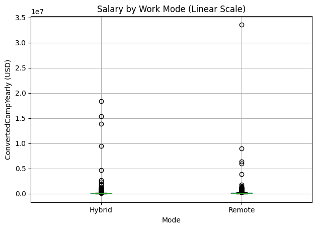
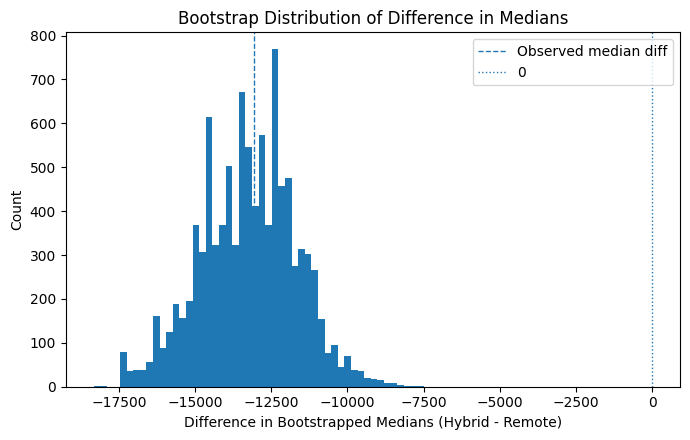

# Stack Overflow Developer Survey Analysis

Survey-based analysis of developer compensation, work mode, education, and role patterns using the Stack Overflow developer survey.

## Preview

<table>
  <tr>
    <td width="50%">
      
    </td>
    <td width="50%">
      
    </td>
  </tr>
</table>

## Project summary

This project analyzes the Stack Overflow developer survey with a focus on salary distributions, work mode differences, education level effects, and role-based summaries. The notebook combines exploratory analysis with statistical inference, including bootstrap-based confidence intervals and hypothesis tests.

## Problem

The project asks how developer compensation and related survey responses vary across work modes, education groups, and developer roles.

## Data

- Stack Overflow developer survey responses
- numeric salary fields such as `ConvertedCompYearly`
- categorical survey fields such as work mode, education, and developer type

## Techniques

- pandas data cleaning and filtering
- exploratory data analysis and summary statistics
- box plots and distribution plots
- bootstrap resampling
- Welch and pooled t-tests
- ANOVA and bootstrap hypothesis testing
- category-level comparisons across developer groups

## Key outputs

- salary comparisons between hybrid and remote work modes
- bootstrap distributions of mean and median differences
- developer-type salary comparisons
- education-level salary analysis
- ANOVA significance testing for grouped compensation differences

## Repository structure

| File | Role |
| --- | --- |
| `xu_1007901512_assignment1.ipynb` | Main analysis notebook |
| `xu_1007901512_assignment1.pdf` | Exported report version of the notebook |
| `preview_salary_mode.png` | Visual preview for salary by work mode |
| `preview_bootstrap_medians.png` | Visual preview for bootstrap median comparison |

## Notes

This repository is organized as a compact portfolio piece rather than an assignment dump. The README surfaces the core analytical story first, with the notebook and report kept alongside the visuals that best summarize the results.

